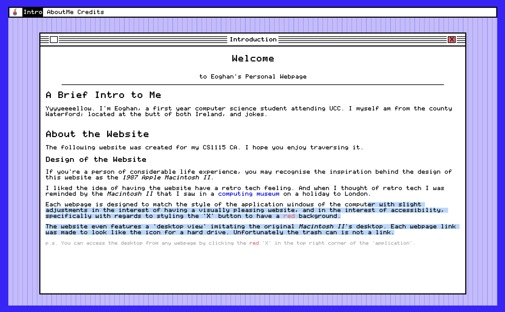
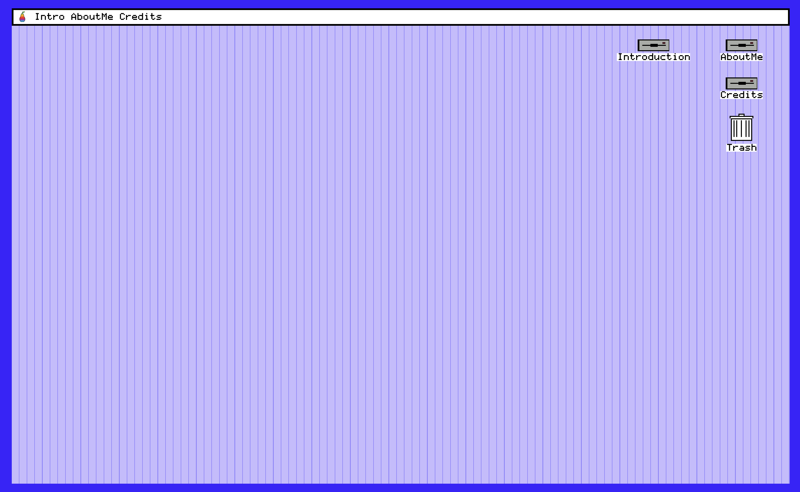

# Macintosh Desktop

A personal website styled to match the desktop of the Macintosh II pc built for a college assignment for learning CSS.

Can be viewed at the [githubpages page](https://eonmurph.github.io/MacintoshDesktop/index.html)

## Homepage

## Desktop

